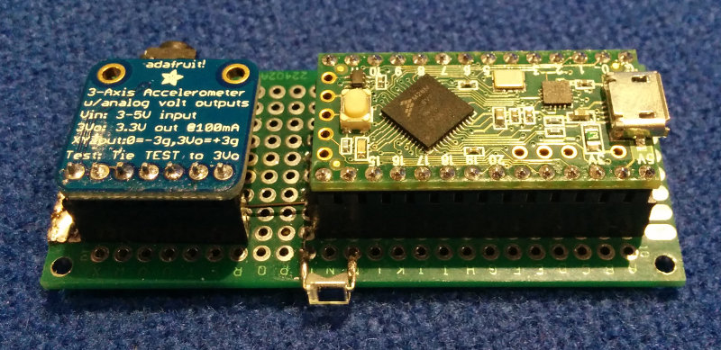

## WALT Latency Timer ##

**DISCLAIMER:** This is not an official Google product.

[Post about WALT on Android Developers Blog](http://android-developers.blogspot.ca/2016/04/a-new-method-to-measure-touch-and-audio.html)

WALT is designed to measure the latency of physical sensors and outputs on phones and computers. It can currently perform the following measurements:

 * Tap latency - time from the moment a finger-like probe touches down (or up) on the screen
   until the kernel timestamps an ACTION_DOWN (or ACTION_UP) event. This physical contact with
   the screen is timed using an accelerometer mounted on the probe - [details](docs/TapLatency.md)
 * Drag latency (scroll) - [details](docs/DragLatency.md)
 * Screen draw latency - using a photodiode that detects whether the screen is black or white.
 * Audio output and microphone latencies - [details](docs/AudioLatency.md)
 

 

## Notes
* Hardware build instructions can be found in this repository under hardware/
* Clock syncrhonization details are described [here](android/WALT/app/src/main/jni/README.md)
* The Android device and Teensy clocks have a tendency to diverge due to
  differing clock frequencies. This means they will go out of sync after
  several minutes. The workaround is to use the app to re-sync the
  clocks. Some, but not all tests in the app will sync the clocks when starting a measurement.
* The Android app uses some native code. In order to build it run `ndk-build` in `<repo root>/android/WALT/app/src/main` before building in Android Studio.
* Python code used to communicate with WALT from Linux and ChromeOS can be found
  [here](https://chromium.googlesource.com/chromiumos/platform/touchbot/+/master/quickstep/)
