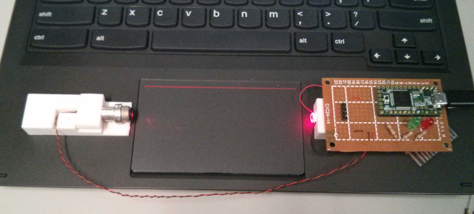

For drag latency WALT uses a laser that shines across the touch device and hits a detector on the
other side. The microcontroller monitors the state of the laser detector and reports (over usb) when
the laser beam is broken and unbroken. A finger dragged back and forth on a touchpad or touch screen
and interrupts a laser beam. Touch events from the pad and laser events are then processed together
to deduce the delay.

A video [here](https://plus.google.com/+FrancoisBeaufort/posts/XctAif2nv4U) shows the measurement
performed using a robotic stylus for extra accuracy and consistency, but the measurement also works
fine with just a finger or a hand held stylus.

