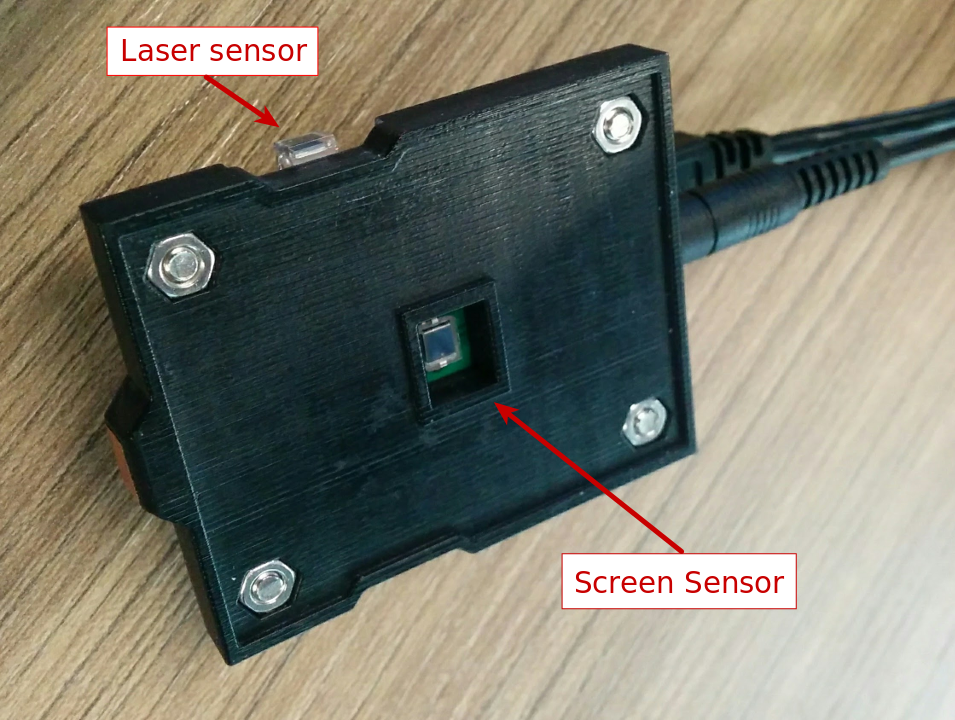

## Screen latency

See also:
 * [Video demonstration](https://www.youtube.com/watch?v=FePSFTxBux4&list=PLd6Fi7WgXfcB4Ma6A-5rPlr1jptNR3RxQ&index=3)
 * [Screen latency section in the usage doc](usage/WALT_usage.md#screen-response-latency)

WALT can detect when screen changes color between white and black using a photodiode.



Because the screen refreshes at predefined intervals (typically 60 Hz), most drawing commands do not take effect immediately but are processes during the next frame render event. See [Choreographer.FrameCallback](https://developer.android.com/reference/android/view/Choreographer.FrameCallback.html). An in-depth explanation about Android graphics can be found in [this video](https://www.youtube.com/watch?v=Q8m9sHdyXnE).

WALT Android app uses View.setBackgroundColor to change the color and reports the time from the beginning of the next frame rendering until the screen changes physically.

The physical transition between colors is not instantaneous and may look very different depending on the direction - from black to white or white to black. Moreover some sections of the screen may update several milliseconds later than others. These details vary considerably between screen technologies and  device models.

Example of screen brightness as a function of time during transition from black to white (blue line) and from white to black (green line) on Nexus 5X. The horizontal lines show the thresholds used by WALT for timing the transition (see #80).


### Sample measurements

Example of log output on Nexus 7:
```
-------------------------------
Median screen response latencies (N=100):
Black to white: 47.3 ms (N=50)
White to black: 50.2 ms (N=50)
Average: 48.8 ms
-------------------------------
```


All measurements below were taken with the device set to max brightness and WALT positioned in the middle of the screen.

| Device       | OS version     | Blk->white [ms]| White->blk [ms]| Average [ms] |
| :---         | :---           |           ---: |           ---: |         ---: |
| Nexus 5      | M4B30Z (6.0.1) |           53.5 |           62.6 |         58.1 |
| Nexus 5X     | NRD91P (7.0)   |           60.7 |           75.4 |         68.1 |
| Nexus 7      | LMY47Q (5.1)   |           47.3 |           50.2 |         48.8 |
| Nexus 9      | MMB29K (6.0.1) |           49.0 |           53.8 |         51.4 |


