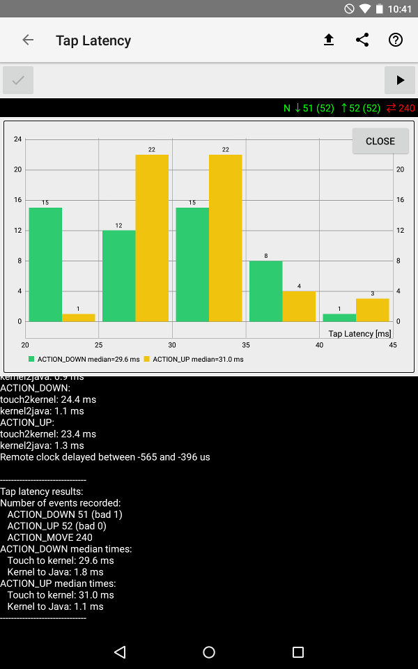

## Tap latency

 * [Video demonstration of tap latency measurement](https://www.youtube.com/watch?v=1xAReF75Cts&list=PLd6Fi7WgXfcCEJg1FDqNCoQfpWo7W3J5a&index=2)
 * [Detailed instructions on how to perform the measurement in usage doc](usage/WALT_usage.md#tap-latency).

WALT uses a “stylus” equipped with an accelerometer. The finger is imitated by a flat metal
tip that is grounded, pretty much any rigid tip can be used as long as it triggers the touch sensor.
When the stylus “collides” with touch screen the accelerometer senses a shock (above 3g) which is
timestamped by the Teensy. In order to generate a similar shock when picking the stylus up from the
screen, the conductive surface and the accelerometer are mounted on a button of a retractable pen.
On the way up, the spring keeps the button in contact with the touch screen for the first few mm of
motion. This allows the hand holding the main part of the pen to gain some speed to which the button is
then abruptly accelerated generating an easily detectable shock.

Linux [Multi Touch (MT)](https://www.kernel.org/doc/Documentation/input/multi-touch-protocol.txt)
implementation timestamps touch events in the kernel as they arrive from the hardware. On Android
the MT events are then exposed in Java as
[MotionEvent](http://developer.android.com/reference/android/view/MotionEvent.html) 
and include the kernel timestamp. For tap, the relevant MotionEvent types are
ACTION_DOWN and ACTION_UP.

Sample measurements

| Device       | OS version     | ACTION_DOWN [ms]| ACTION_UP [ms]| Kernel to Java [ms] |
| :---         | :---           |           ---: |           ---: |                 ---: |
| Nexus 5      | M4B30Z (6.0.1) |           26.9 |           15.9 |                  3.3 |
| Nexus 5X     | NRD91P (7.0)   |           25.0 |           22.5 |                  2.4 |
| Nexus 7      | LMY47Q (5.1)   |           29.6 |           31.0 |                  1.4 |
| Nexus 9      | MMB29K (6.0.1) |           18.7 |           19.9 |                  1.3 |
| Pixel C      | NMF26H (7.1.1) |           23.8 |           24.3 |                  1.1 |
| Pixel        | NHG47K (7.1.2) |            9.6 |           28.1 |                  2.0 |
| Pixel XL     | NHG47K (7.1.2) |           14.2 |           14.4 |                  1.8 |

