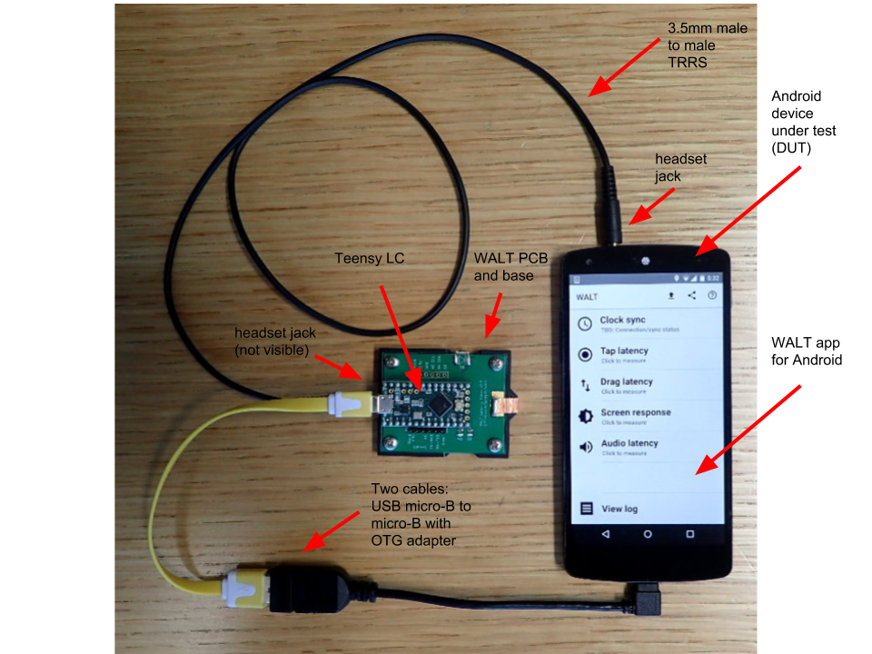
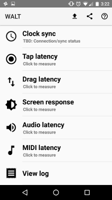
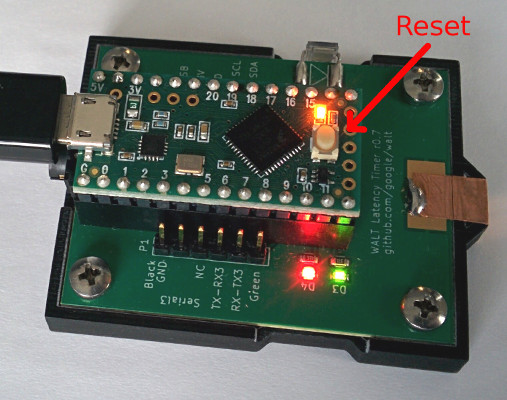
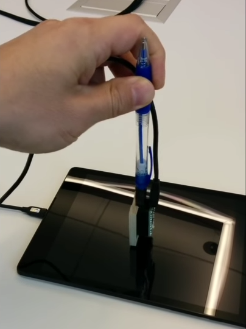
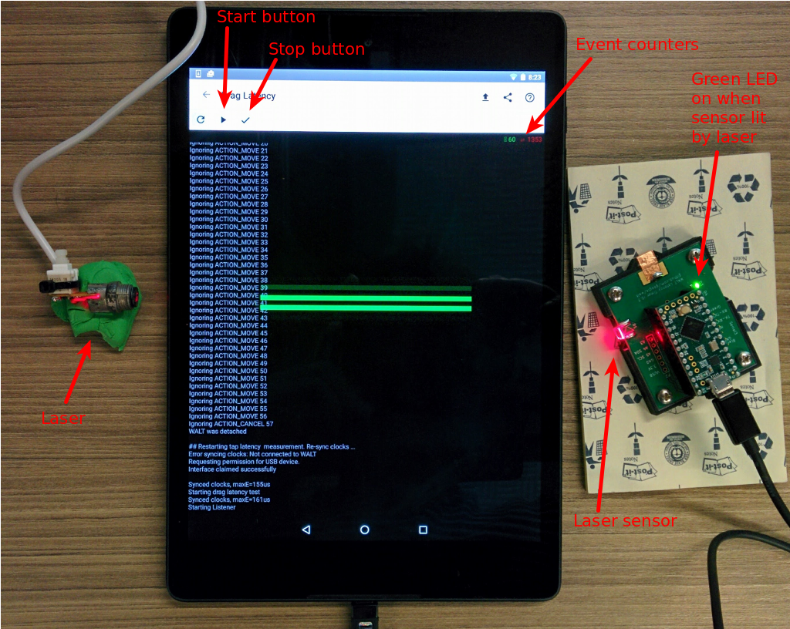

# WALT Setup

WALT (**W**hat an **A**wesome **L**atency **T**ester) is a tool for testing latency on Android devices.
This document will show you how to set up and use your WALT.

About WALT:

 * Source code: https://github.com/google/walt
 * YouTube [playlist 1](https://www.youtube.com/playlist?list=PLd6Fi7WgXfcCEJg1FDqNCoQfpWo7W3J5a) and [playlist 2](https://www.youtube.com/playlist?list=PLd6Fi7WgXfcB4Ma6A-5rPlr1jptNR3RxQ)
 * [Android Developers blog post](http://android-developers.blogspot.com/2016/04/a-new-method-to-measure-touch-and-audio.html)

## Prerequisites

WALT kit:
 * Assembled WALT PCB and base, with DIP socket for Teensy LC
 * [Teensy LC](http://www.pjrc.com/teensy/teensyLC.html) inserted into DIP socket
 * 3.5mm male-to-male TRRS cable
    ([like this](http://www.infinitecables.com/audio-and-pro-audio-cables/3.5mm-cables/3.5mm-male-to-3.5mm-male-4c/3.5mm-male-to-3.5mm-male-4c-black/2ft-3.5mm-4c-male-to-male-28awg-ft4-black/))
 * Pen modified to replace the top button by a male TS
 * Optional: laser pointer for measuring touch drag latency

If anything is missing from the list above, please contact the person from whom you received your WALT.

A test device and cables:
 * Android device with USB micro-B female or type C female and a 3.5mm headset jack
 * USB OTG (On-The-Go) adapter for your Android device (Examples: [A female to C male](https://store.google.com/product/usb_type_c_to_usb_standard_a_adapter), [A female to micro-B male](https://www.amazon.com/Cable-Matters-Micro-USB-Adapter-6-Inch/dp/B00GM0OZ4O))
 * USB [Micro-B male to A male](http://www.staples.com/Staples-6-USB-to-Micro-B-Cable-18809-/product_837384) (the usual one we used for everything before type-C)
 * Laser pointer, if not supplied in the kit




## Setup

[Video demonstration](https://www.youtube.com/watch?v=qR48GPepyxU&list=PLd6Fi7WgXfcB4Ma6A-5rPlr1jptNR3RxQ&index=2)

 * Install and run the [WALT Android App](https://play.google.com/store/apps/details?id=org.kamrik.latency.walt&hl=en)
 * Connect WALT to the Android headset using the 3.5mm male to male TRRS cable
 * Connect WALT to the Android USB port using the cables above. (see photo at top of doc)
 * You may be prompted to grant the WALT app permission to use the USB, tap "OK"
 * All 3 LEDs will light up when WALT receives power (see photo below), they will be turned off once the app synchronizes clocks with WALT.


## Programming the WALT firmware

1.  Launch the app, the main screen is pictured below.
1.  Verify you have the [latest version](https://github.com/google/walt/blob/master/android/WALT/app/build.gradle#L13) installed by tapping on "View log"
1.  Tap "Clock sync" on main menu.
1.  Press the Teensy reset button (see photo below)
1.  Tap "Reprogram WALT"
1.  At this stage you will see several USB permission dialogs. Confirm them all by pressing OK. This is due to WALT presenting itself as different USB devices during reprogramming and normal operation
1.  All 3 LEDs will light briefly (see photo below)
1.  Tap "Reconnect"
1.  Verify that the WALT device has been programmed correctly by running one of the tests below





Below is an example of WALT app log when it starts and successfully connects
to a WALT device. Note the first line and make sure that you use the latest
version. The last line means that the WALT device clock is behind the Android
clock but by no more than 161 microseconds. Values about about 1000 us are a
sign of clock synchronization problems.


```
WALT v0.1.5  (versionCode=6)
WALT protocol version 4
DEVICE INFO:
  google/volantis/flounder:6.0.1/MMB29K/2419427:user/release-keys
  Build.SDK_INT=23
  os.version=3.10.40-ga54a4f4
Requesting permission for USB device.
Interface claimed successfully

Synced clocks, maxE=161us
```

# Running the latency tests

This section describes how to run each test and interpret the results.


## Audio input latency (microphone)

The Teensy will generate a pulse of audio data which will be received at the 3.5mm headset jack. The time delta between the audio pulse being generated and being received by the WALT application is measured.

 * Tap "Audio latency"
 * Tap the microphone icon in the top left
 * Wait for results


Below is the output of a test on Nexus 9. The last two lines show the 6 individual measurements and their median. The time measured here is the time that passed from the recording of the _last_ frame in the buffer and until the software callback fired. The length of the optimal buffer in time units can be calculated using the first two lines: 128 frames divided by 48kHz frame rate is about 2.67 ms.


```
Optimal frame rate is: 48000
Optimal frames per buffer is: 128
Audio engine created
Audio recorder created; starting test
Synced clocks, maxE=154us
Beeped, reply: 1039241
Processed: L_cb = 1.167 ms, L_eq = 171.558 ms, noisy frame = 16799
...
Beeped, reply: 13621259
Processed: L_cb = 0.907 ms, L_eq = 203.991 ms, noisy frame = 14465
Remote clock delayed between -30 and 892 us
deltas: [1.1671666666666278, 1.1871666666666278, 0.984, 0.9981666666666279, 1.7278333333333722, 0.9071666666666278]
Median audio recording latency 1.1 ms
```

## Audio output latency

The WALT app will generate a pulse of audio data which will be transmitted over the 3.5mm headset jack and received by the Teensy. The time delta between audio being transmitted by the app and received by the Teensy is measured

 * Set volume to maximum in Settings -> Sound
 * Tap "Audio latency"
 * Tap the play button ▶ in the top right
 * Results are displayed in the log window, example below.

```
Beeping...
Beeped, dtJ2N = 0.059 ms
beep detected, total latency = 10.44, normal latency = 10.09, mInitiatedBeeps = 1, mDetectedBeeps = 1
...
Remote clock delayed between -53 and 349 us
deltas: [10.439, 12.272, 11.708, 12.194, 12.919, 11.458, 12.985, 10.914, 10.935, 10.631]
Median Java to native latency 0.006 ms
Median total audio latency 11.6 ms
Median callback to output time 9.9 ms
```

The callback to output time on the last line, 9.9 ms is the time from the execution of the
[OpenSLES BufferQueue callback that enqueued the buffer](https://github.com/google/walt/blob/master/android/WALT/app/src/main/jni/player.c#L107)
until the first frames of that buffer were detected by WALT device via the headphone jack.


## Screen response latency

[Video demonstration](https://www.youtube.com/watch?v=FePSFTxBux4&list=PLd6Fi7WgXfcB4Ma6A-5rPlr1jptNR3RxQ&index=3)

 * Tap screen response
 * Set screen brightness to maximum. On phones using PWM for screen backlight brightness control, yo man need to turn adaptive brightness off (settings -> Display -> Adaptive Brightness)
 * Position WALT with the screen sensor looking at the screen (the light sensor recessed into the large plastic surface).
 * Click start  ▶
 * The screen will blink some 20 times. The orange LED on the Teensy will also blink every time the bottom light sensor detects a change.
 * Results are displayed in the log window

```
Starting screen response measurement
Synced clocks, maxE=162us
Blink count was: 0
Synced clocks, maxE=857us
Starting Listener
======
doBlink.run(), mInitiatedBlinks = 0 mDetectedBlinks = 0
blink counts 1 1
======
...
======
doBlink.run(), mInitiatedBlinks = 20 mDetectedBlinks = 20
Stopping Listener
Listener stopped
Remote clock delayed between -16 and 628 us
deltas: [69.908, 53.902, 54.715, 50.867, 70.73, 50.188, 71.344, 85.259, 40.691, 68.554, 72.016, 51.666, 71.826, 51.234, 71.896, 52.131, 68.943, 51.768, 71.919, 48.812]
Median latency 61.6 ms
```

At the time of this writing (WALT v0.1.5) the number reported on the last line
of the log above is the time from a call to View.setBackgroundColor() until
the measured screen brightness crosses a threshold
[hard coded in WALT firmware](https://github.com/google/walt/blob/master/arduino/walt/walt.ino#L70).
This has significant drawbacks and will change in future versions.


## Tap latency

[Video demonstration](https://www.youtube.com/watch?v=1xAReF75Cts&list=PLd6Fi7WgXfcCEJg1FDqNCoQfpWo7W3J5a&index=2)

 * Disconnect the audio cable
 * Insert the supplied stylus (pen with audio jack) into the WALT's audio connector
 * Click "Tap Latency"
 * Tap the black part of the screen with WALT's copper tape tip while holding by the pen (photo below). Repeat some 20-30 times. Try to keep WALT pressed against the screen for a bit longer than you would usually keep the finger on the glass during a momentary tap.
 * Click the checkmark button (top left of the screen), results will be calculated and displayed

WALT has an accelerometer that is used to detect when the copper tip collides with the glass. The copper tip is grounded and triggers the touch sensor. The stylus springy action helps generate a collision shock detectable by accelerometer on the way back, away from the glass.



In the log below the following abbreviations are used:
 - p2k - physical to kernel - in most cases this is the interesting time.
 - k2c - kernel to (java) callback


```
## Restarting tap latency  measurement. Re-sync clocks ...
Synced clocks, maxE=158us

...

ACTION_DOWN event received: Event: t=10269422 x=871.7 y=1026.1 slot=-1 num=0 ACTION_DOWN
Received S reply: 10247405

ACTION_DOWN: dt_p2k = 22.0 ms
Ignoring ACTION_MOVE 11
Ignoring ACTION_MOVE 12
Ignoring ACTION_MOVE 13
Ignoring ACTION_MOVE 14
Ignoring ACTION_MOVE 15

ACTION_UP event received: Event: t=10365071 x=871.7 y=1026.1 slot=-1 num=0 ACTION_UP
Received S reply: 10348526

ACTION_UP: dt_p2k = 16.5 ms

...

## Processing tap latency data
Remote clock delayed between -60 and 93 us
Counts: ACTION_DOWN 20 (bad 1), ACTION_UP 21 (bad 0), ACTION_MOVE 162

ACTION_DOWN:
[26.515, 22.017, 26.952, 29.363, 29.63, 26.624, 31.581, 26.565, 31.335, 26.83, 31.786, 14.702, 19.796, 20.626, 16.688, 18.001, 19.044, 20.261, 17.66, 26.044]
[1.774, 0.872, 0.888, 0.948, 1.749, 1.781, 1.698, 1.375, 1.709, 1.985, 2.522, 0.994, 1.008, 0.813, 0.746, 1.289, 1.158, 1.093, 0.891, 3.755]
Medians, p2k & k2c [ms]: 26.3    1.2

ACTION_UP:
[16.572, 19.515, 16.545, 18.724, 15.188, 14.682, 18.156, 11.69, 20.367, 15.135, 20.601, 44.948, 17.517, 129.513, 24.681, 21.21, 21.979, 22.805, 133.306, 23.876, 17.579]
[2.161, 2.02, 1.761, 2.222, 1.228, 1.24, 1.48, 1.42, 1.315, 4.034, 1.279, 1.957, 1.041, 2.058, 2.903, 1.725, 0.99, 2.124, 1.398, 3.018, 0.945]
Medians, p2k & k2c [ms]: 19.5    1.7

```

## Drag/scroll latency

[Video demonstration](https://www.youtube.com/watch?v=pVy5AYVzf7Q&list=PLd6Fi7WgXfcB4Ma6A-5rPlr1jptNR3RxQ&index=4)

Drag latency is measured by dragging a finger up and down along the screen. The finger interrupts a laser beam positioned across the screen. By comparing the timings of those beam interruptions with Android touch events the WALT app calculates the delay.


 * Position a laser pointer so that the beam crosses the screen roughly in the middle. A convenient method for positioning the laser pointer is by using modeling clay (plasticine)
 * Place WALT on the other side so that the beam hits the WALT optical sensor looking sideways. A green LED (marked D3) will light up whenever the beam hits the sensor
 * Click the start button ▶, a green animated line will start going up and down the screen
 * Drag your finger on the screen, following the animated line
 * The green counter in the top right corner counts how many times the laser sensor changed state. Each crossing of the beam add 2 to that counter. Continue until the counter shows at least 60
 * Click the finish **✓**(check mark) button, results will be displayed in the black window



# Collecting Systrace logs

WALT is able to log physical events as well as system events into systrace. This allows us to look at the system-level calls that occur between the application triggering a change and the WALT device receiving a physical response.

  * In the WALT app go to Settings->General and check `Enable systrace logging`.
  * On your workstation, follow the [instructions for systrace](https://developer.android.com/studio/profile/systrace-commandline.html) on the command line
  * From the `android-sdk/platform-tools/systrace` directory, run `python systrace.py --walt`. If `--walt` is not recognized as an option, clone the latest version of [systrace repo](https://github.com/catapult-project/catapult) and from the `catapult/systrace/systrace` directory run `python run_systrace.py --walt`.
  * Conduct a test through the WALT app. When the test is complete, you should see that TraceLogger wrote some events to a file.
  * Press enter on your workstation to end the trace and pull the logs from the phone, and the traceview will be generated as HTML.
  

# Troubleshooting

  * Make sure your micro-USB cable is not power-only (can carry data). If it has a button to switch between data and no-data modes (e.g. the KAA cable), click the button.
  * Make sure volume control on Android DUT is at maximum (update in settings -> sound while TRRS cable is inserted).
  * Some devices use pulse width modulation (PWM) to control screen brightness. Disable adaptive screen brightness and set brightness manually to maximum.
