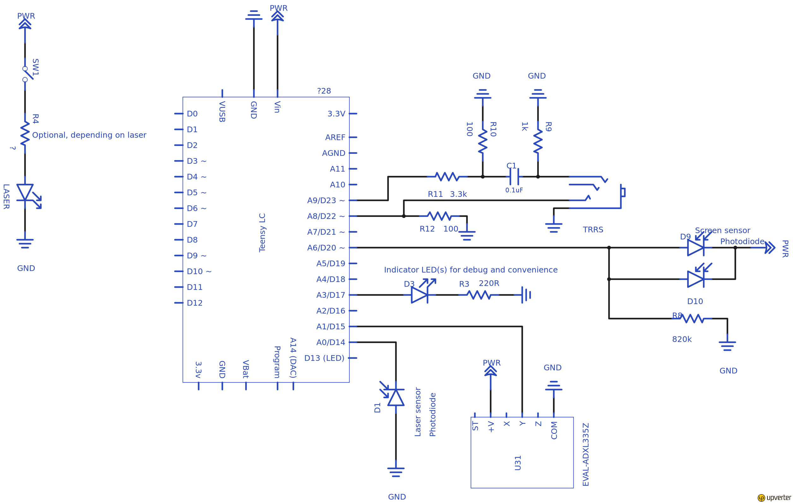

## Hardware assembly ##
Depending on your specific needs, you may want to introduce some variations.
In most cases it's possible to assemble a device with partial functionality (e.g. only for audio latency) on a solderless breadboard.

### List of suggested parts ###

 * USB OTG cable like
   [this](http://www.amazon.com/Generic-Micro-Cable-Cellphone-Tablet/dp/B00AYPEL56)
   (or a USB Type-C to A adapter)
   for connecting WALT to your phone or tablet
 * Microcontroller board - [Teensy LC](https://www.pjrc.com/teensy/teensyLC.html)
 * Photodiodes - [BPW34](http://www.digikey.com/product-detail/en/osram-opto-semiconductors-inc/BPW34/475-1070-ND/607274) (3 units)
 * Laser - any laser pointer will do, ~1 mW is just fine (5 mW is ok, but avoid stronger ones)
 * Accelerometer board [Adafruit ADXL335](https://www.adafruit.com/product/163) **with filter capacitors removed**.
   It's very important to remove the filter capacitors, otherwise they smooth out the abrupt shock we are looking for.
   Alternatively use the ADXL335 chip directly without the breakout board, but it's rather difficult to solder manually.
 * Some resistors and capacitors - see schematics
 * TRRS connector or wire for audio measurements
 * Clipboard, like [this one](https://upload.wikimedia.org/wikipedia/commons/c/c0/Wood-clipboard.jpg)

### Schematic ###
The current hardware version we use (r0.7) can be found as KiCAD project in this directory.
 * [PDF](WALT_schematic.pdf)
 * Blank PCBs can be ordered directly via [this shared project on OSH Park](https://oshpark.com/shared_projects/M5Z8fYCX)
 * List of parts for version r0.7 - [BOM as a tsv file](WALT_bom_r07.tsv)

### Microcontroller code ###

Important pin numbers from the code listed below, defined in [walt.ino](../arduino/walt/walt.ino)

 * PD_LASER_PIN 14 - Photodiode that looks at the laser
 * G_PIN 15 // Same as A1 - Accelerometer for detecting when touch probe hits the screen
 * PD_SCREEN_PIN 20 // Same as A6 - Photodiode that looks at the screen
 * AUDIO_PIN 22 // Same as A8 - Detects audio signal from headphones output
 * MIC_PIN 23 // Same as A9 - uses PWM to generate a tone for measuring microphone latency.

### Schematic - older version ###
An older version can be found
[here on Upverter](https://upverter.com/kamrik/8af1f3b04e47ab78/WALT_w_audio/)

### Notes ###

 * If using Teensy 3.1 instead of LC, it won’t be able to directly read
   the screen photodiodes - a buffer opamp will be needed. The screen photodiodes
   are bundled as a couple to produce more current, a single photodiode with 1.5M
   resistor should provide the same result, but might be at the limit of what the
   teensy can measure (input impedance), and again, an opamp will be needed.
 * BPW34 photodiode has a small protrusion on the cathode pin (cathode marker).
   Anode has a white dot near it.
 * Note the different setup of the laser and screen photodiode. The laser one
   uses internal pullup resistor (about 20k), enabled by pinMode(PD_LASER_PIN,
   INPUT_PULLUP);
